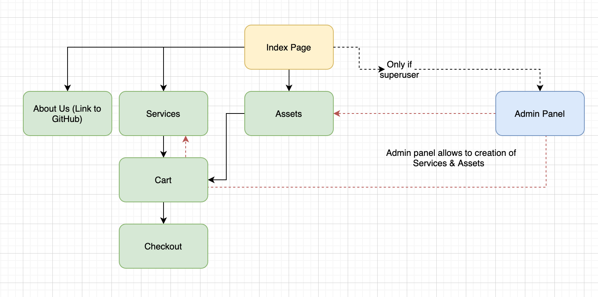
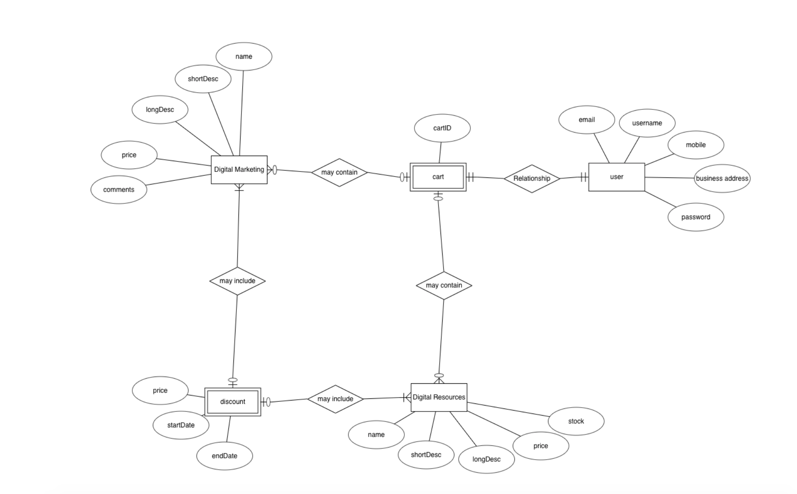

# KANGA | Digital Marketing 

## Introduction 
KANGA is a digital marketing start-up focused on delivering quality digital marketing consultancy and services. The purpose of this project is to create a platform to showcase KANGA's works as well as allow first-time users to hire our services through a native e-commerce function.

KANGA hopes to use this website to acquire new sales through it's e-commerce platform.

Visit the site [here](https://dk-kanga.herokuapp.com/) 

## How to demo the project 

### To Log in as a regular user: 
| Username | regularuser@mailinator.com |
|----------|----------------------------|
| Password | pass123word                |

### Privileges of a regular user
* Able to add to cart
* Able to checkout purchases 

### To Log in as a super user: 
| Username | kolipop@mailinator.com |
|----------|------------------------|
| Password | pass123word            |

### Privileges of a super user

* Able to access navbar admin tab  
* Able to access django admin panel via the shortcut admin tab 
* Able to create Services products 
* Able to creat Assets products 
* Able to delete all products 
* Able to edit all products 

## UX 
### Strategy - User Story
There are 03 types of users for this website 
* Owner (superuser)
* Registered User (user)
* Public (anonymous user)

#### Owner (superuser) Goals 
* List & sell digital marketing and related services via the platform 
* Delete irrelevant products 
* Edit products that change in scope or description 

The site owner would ideally use this platform to allow clients to make direct purchases for services he provides. This is more efficient compared to traditional email quotation and offers pricing transparency. 

#### Registered User (user) Goals 
* The site should attract user to make purchases. 
* By viewing the brief portfolio on the index page, the user can choose to purchase services or ready made assets such as stock photo off the platform. 

### Scope
* Content: 
    * Text 
    * Icons 
    * Banner Images
    * Placeholder work images 
* Functional: 
    * Search function for name of service 
    * Search function for category 

## Features left to implement 

### Structure

The 3-click rule was applied for UX strategy when designing the structure of the site. Despite numerous prototyping to work around the steps for payment methods, the best UX strategy was eventually to allow a redirect to stripe to make payment there. 
Users are still able to get from index page to check out page in 3-steps. 

#### Skeleton
#### Index Page
With inspiration from SunBird Creative, I decided to follow a simple visual structure for the site's skeleton. The reason was due to the work and products being the center of focus rather than unconventional layout or designs. 

#### Sales Page (Similar for Digital Assets and Services e-commerce page)
Sales page structure is clean and easy to navigate. I wanted a side search column for people to search for the types of product they are looking for.

#### Surface
Only 3 colors were used for the site. Mustard yellow, Light Grey and White. These color are consistent with the brand identity of KANGA. 
Typography used was Roboto and Calibri. 

## Database Design 

ER Diagram shows the initial design for the backend of the website. A discount entity was present, but, as mentioned above, due to time constraints, it was omitted in this version. Discount entity will be implemented for future updates to encourage users to make purchases with a discount coupon. 

## Deployment 
This website is deployed on Heroku. The URL for the deployed website is https://dk-kanga.herokuapp.com/

To deploy on Heroku:
* Download or Clone the master branch from github, https://github.com/darylkangjh/Project-4
* To list all the requirements in requirements.txt, run the following command in terminal:
    * pip3 freeze --local > requirements.txt
    * Set Debug to False
    * Procfile need to be created to run gunicorn upon deployment
    * Git push to Heroku Master after all the documents are properly set up
    * All public keys and private keys for the following need to be added to in Heroku Config Vars settings:
        * CLOUDINARY_API_KEY
        * CLOUDINARY_API_SECRET
        * CLOUDINARY_CLOUD_NAME
        * DATABASE_URL
        * EMAIL_HOST_PASS
        * EMAIL_HOST_USER
        * endpoint_secret (for Stripe)
        * SECRET_KEY
        * STRIPE_PUBLISHABLE_KEY
        * STRIPE_SECRET_KEY

## Testing 

### Manual Testing 

Manual testing was done to ensure the front-end routes are protected and allowed for 

| Step | Description                                                                                | Expected Outcomes                                                                                                                                                  | Actual Test |
|------|--------------------------------------------------------------------------------------------|--------------------------------------------------------------------------------------------------------------------------------------------------------------------|-------------|
| 1    | Load index page                                                                            | Page should load with a "Please login" above the slider or a "Welcome <username>".                                                                                 | As expected |
| 2    | Load Services page                                                                         | Page should load with a banner. Digital Marketing services should appear below the banner together with the search tab                                             | As expected |
| 3    | Add a service                                                                              | Only super user can add a service. Item added via the admin tab on the navbar available only to superuser.                                                         | As expected |
| 4    | Add a service not available to regular user                                                | Regular user will not be able to see the admin panel. Testing done by loggin in as regular user.                                                                   | As expected |
| 5    | Edit a service not available to regular user                                               | Regular user will not be able to edit the individual products. Testing done by logging in as regular user.                                                         | As expected |
| 6    | Edit a service not available to regular user through manual keying of route in the url     | Regular user will not be able to edit the individual products by manually entering a route and id number in the url. Testing done by logging in as regular user.   | As expected |
| 7    | Add a service not available to anonymous user                                              | Anonymous user will not be able to see the admin panel. Testing done by not logging in.                                                                            | As expected |
| 8    | Edit a service not available to anonymous user                                             | Anonymous user will not be able to edit the individual products. Testing done by not logging in.                                                                   | As expected |
| 9    | Edit a service not available to anonymous user through manual keying of route in the url   | Anonymous user will not be able to edit the individual products by manually entering a route and id number in the url. Testing done by not logging in.             | As expected |
| 10   | Delete a service not available to regular user through manual keying of route in the url   | Regular user will not be able to delete the individual products by manually entering a route and id number in the url. Testing done by logging in as regular user. | As expected |
| 11   | Delete a service not available to anonymous user through manual keying of route in the url | Anonymous user will not be able to delete the individual products by manually entering a route and id number in the url. Testing done by not logging in.           | As expected |
| 12   | Delete a service                                                                           | Only super user can delete a service. delete button is only available to superuser on individual product. On delete, item removed.                                 | As expected |
| 13   | Edit a service                                                                             | Only super user can edit a service. edit button is only available to superuser on individual product. On edit, form with populated data shows for editing.         | As expected |
| 14   | Search test for services                                                                   | "Photo" entered into Item Name should only display photography service.                                                                                            | As expected |
| 15   | Add an asset                                                                               | Only super user can add an asset. Item added via the admin tab on the navbar available only to superuser.                                                          | As expected |
| 16   | Add an asset not available to regular user                                                 | Regular user will not be able to see the admin panel. Testing done by loggin in as regular user.                                                                   | As expected |
| 17   | Edit a asset not available to regular user                                                 | Regular user will not be able to edit the individual products by manually entering a route and id number in the url. Testing done by logging in as regular user.   | As expected |
| 18   | Add a asset not available to anonymous user                                                | Anonymous user will not be able to see the admin panel. Testing done by not logging in.                                                                            | As expected |
| 19   | Edit a asset not available to regular user through manual keying of route in the url       | Regular user will not be able to edit the individual products by manually entering a route and id number in the url. Testing done by logging in as regular user.   | As expected |
| 20   | Edit a asset not available to anonymous user                                               | Anonymous user will not be able to see the admin panel. Testing done by not logging in.                                                                            | As expected |
| 21   | Edit a asset not available to anonymous user through manual keying of route in the url     | Anonymous user will not be able to edit the individual products by manually entering a route and id number in the url. Testing done by not logging in.             | As expected |
| 22   | Delete a asset not available to regular user through manual keying of route in the url     | Regular user will not be able to delete the individual products by manually entering a route and id number in the url. Testing done by logging in as regular user. | As expected |
| 23   | Delete a asset not available to anonymous user through manual keying of route in the url   | Anonymous user will not be able to delete the individual products by manually entering a route and id number in the url. Testing done by not logging in.           | As expected |
| 24   | Delete a asset                                                                             | Only super user can delete a asset. delete button is only available to superuser on individual product. On delete, item removed.                                   | As expected |
| 25   | Edit a asset                                                                               | Only super user can edit a asset. edit button is only available to superuser on individual product. On edit, form with populated data shows for editing.           | As expected |
| 26   | Search test for asset                                                                      | "Monkey" entered into Item Name should only display "Space Monkey".                                                                                                | As expected |
| 27   | Add to cart                                                                                | Items added to cart from services and assets will be totalled up as per items                                                                                      | As expected |
| 28   | Checkout                                                                                   | Upon checkout and redirect to stripe, payment made in test mode should reflect a successful webhook on stripe                                                      | As expected |

## Technologies Used 
1. HTML, CSS & Javascript 
2. Bootstrap 
3. Python 
4. SQLite (during development)
5. Postgres (when deployed onto Heroku)
6. Heroku (deployment)
7. Django-Taggit for tagging module https://django-taggit.readthedocs.io/en/latest/getting_started.html#
8. CrispyForms (Together with Boostrap 4) https://django-crispy-forms.readthedocs.io/en/latest/install.html#
9. Ekkolightbox (https://cdnjs.com/libraries/ekko-lightbox)

## Credits & Acknowledgement 
1. GitIgnore template by www.toptal.com/developers/gitignore/api/django.
2. Favicon icons 
3. Google Fonts 
4. Freepik (Premium) - No attribution required for assets used
5. Bootsnip (Template inspiration for search panel)
6. Sunbird creative (for providing index page image placeholder)
7. Paul Chor, Code Insitute & Trent Global College
8. Andrew Sui & Fareez (for advise and help)